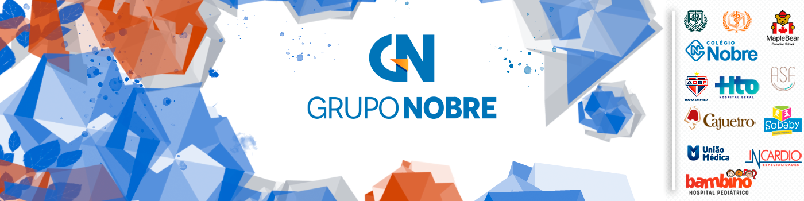

#  Desafio Técnico - Desenvolvedor Full Stack Grupo Nobre

> Bem-vindo ao desafio técnico do Grupo Nobre! Neste documento, você encontrará todas as informações necessárias para completar o nosso desafio de CRUD. Boa sorte!

## Descrição do Desafio

O desafio consiste na implementação de uma aplicação de Lista de Tarefas (Todo List) e um CRUD (Create, Read, Update, Delete) de pessoas. 

### Todo List

Implemente um CRUD de tarefas, onde cada tarefa deve permitir as seguintes operações:
- Criação de novas tarefas.
- Listagem das tarefas existentes.
- Edição das tarefas.
- Exclusão de tarefas.

### CRUD de Pessoas

Cada pessoa deve ter as seguintes informações:
- Nome
- Email
- Telefone
- Data de Nascimento

## Requisitos

### Front-end

- **Linguagens obrigatórias:** HTML, CSS, JavaScript / TypeScript (Puro/React/Vue/Angular).
- Deve conter:
  - Uma página para listar todas as tarefas e pessoas cadastradas no banco.
  - Uma página com um formulário para cadastrar novas tarefas e pessoas.
  - Uma página para editar as informações das tarefas e pessoas, com os campos já preenchidos.
  - Opção de excluir tarefas e pessoas do banco.
- **Responsividade:** A aplicação deve funcionar bem em dispositivos móveis.

### Back-end

- **Linguagens obrigatórias:** Node.js / PHP (Laravel).
- Deve seguir o padrão de arquitetura MVC (Model-View-Controller).
- **Banco de Dados:** Utilize MongoDB ou MySQL.

## Instruções

1. **Implemente o CRUD** conforme os requisitos especificados acima.
2. **Certifique-se de que o projeto está bem organizado**, seguindo as melhores práticas de desenvolvimento e arquitetura MVC.
3. **Teste sua aplicação** para garantir que todas as funcionalidades estão operacionais.
4. **Após finalizar o projeto, suba-o em um repositório público no GitHub**.
5. **Copie o link do projeto e responda ao e-mail que foi enviado, marcando o dia da sua entrevista com o link**.

## Observações

- Não é necessário entregar o desafio completo, queremos apenas analisar a lógica de desenvolvimento; mas o que entregar será considerado um diferencial.
- O tempo total para realização do desafio é de 1h30.
- Qualquer problema técnico durante o desafio, por favor, entre em contato com a equipe de T.I que estará no local.

## Critérios de Avaliação

1. **Organização do Código:** Estrutura clara e bem organizada.
2. **Funcionalidade:** Implementação correta das funcionalidades de CRUD.
3. **Boas Práticas:** Uso adequado das melhores práticas de desenvolvimento.
4. **Documentação:** Código comentado e README.md explicativo.
5. **Padrão MVC:** Seguir o padrão de arquitetura solicitado.

## Diferenciais

- Implementação de autenticação usando JWT.
- Publicação do repositório no GitHub.
- Uso de boas práticas de segurança no backend.
- Implementação de feedbacks visuais (como animações) para ações do usuário.

## Dicas

- Foque na lógica de desenvolvimento e organização do código.
- Gerencie bem o seu tempo para conseguir implementar o máximo possível dentro do prazo.

## Referências Úteis

- [Documentação do React](https://reactjs.org/docs/getting-started.html)
- [Documentação do Node.js](https://nodejs.org/en/docs/)
- [Documentação do MongoDB](https://docs.mongodb.com/)
- [Documentação do MySQL](https://dev.mysql.com/doc/)
- [Documentação do PHP](https://www.php.net/docs.php)

Boa sorte e bom desafio!
